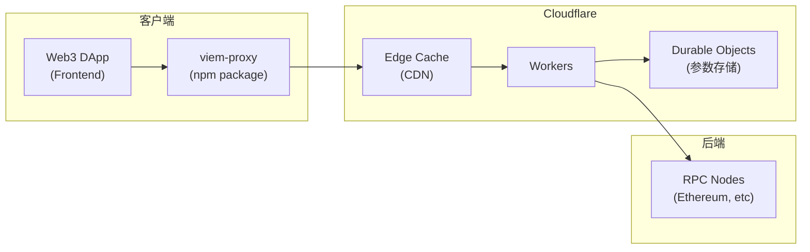
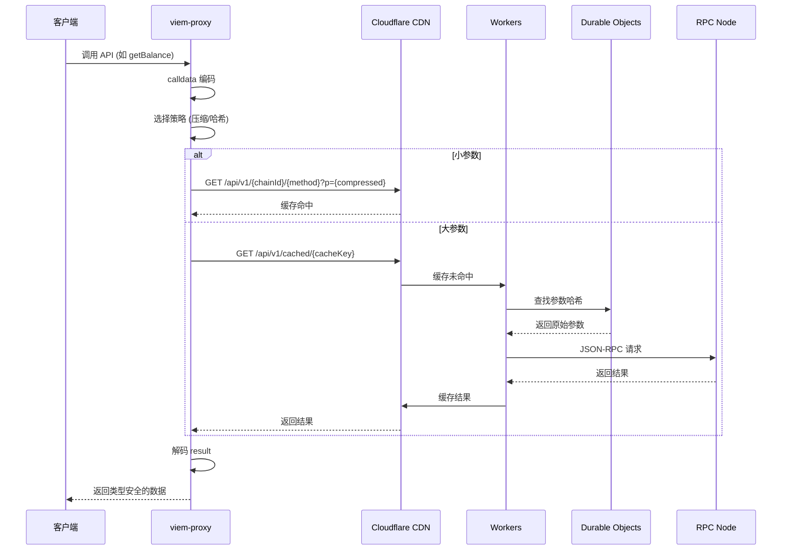
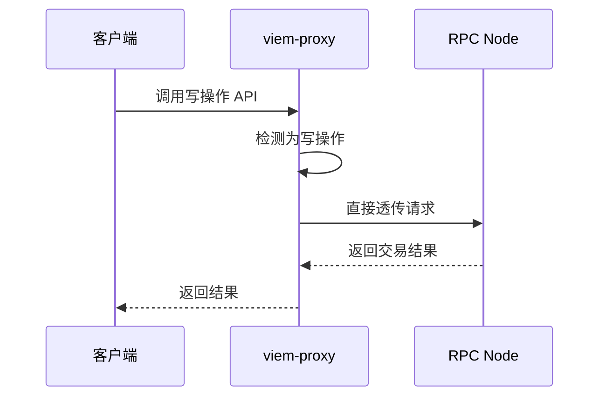

# viem-proxy 产品需求文档 (PRD)

## 项目概述

### 产品名称
viem-proxy - 基于 Cloudflare 的 Web3 RPC 缓存代理

### 产品定位
一个高性能的 Web3 RPC 缓存代理库，通过 Cloudflare CDN 优化区块链数据读取性能，为 Web3 前端应用提供更快的用户体验。

### 核心价值
- **性能提升**：将 JSON-RPC 转换为可缓存的 HTTP GET 请求，利用 CDN 大幅提升响应速度
- **开发体验**：与 viem 完全兼容的 API，零学习成本迁移
- **成本优化**：通过智能缓存策略减少 RPC 调用成本
- **全球加速**：基于 Cloudflare 全球网络，为用户提供就近访问

## 用户画像

### 主要用户
- **Web3 前端开发者**：构建 DApp、DeFi 应用的开发团队
- **区块链基础设施团队**：提供 Web3 服务的公司和团队
- **个人开发者**：构建区块链工具和应用的独立开发者

### 使用场景
- DeFi 应用频繁查询代币余额、价格数据
- NFT 市场展示代币元数据和所有权信息
- 区块链浏览器展示交易和区块数据
- 钱包应用查询账户状态和交易历史

## 功能需求

### 1. 核心功能

#### 1.1 客户端代理库 (npm 包)
**功能描述**：提供与 viem 完全兼容的客户端库

**技术要求**：
- 基于 viem 进行扩展和包装
- 代理 viem 的顶层函数 (如 `getBalance`, `readContract` 等)
- 写操作直接透传到原始 RPC
- 客户端负责 calldata 编解码，保持类型安全
- 智能参数压缩和哈希引用机制
- 提供 TypeScript 完整类型支持

**API 设计**：
```typescript
// 替换 viem 导入
import { createPublicClient, http } from 'viem-proxy'
// 其他 API 保持不变
import { mainnet } from 'viem/chains'

const client = createPublicClient({
  chain: mainnet,
  transport: http(),
  // 新增配置项
  proxy: {
    enabled: true,
    endpoint: 'https://proxy.example.com',
    debug: false,
    fallback: true
  }
})
```

**缓存策略**：
- **历史数据**（区块号 < latest - 100）：缓存 1 年
- **近期数据**（区块号 >= latest - 100）：缓存 10 分钟
- **最新数据**（latest、pending）：缓存 12 秒
- **账户状态**：缓存 30 秒
- **合约常量**：缓存 1 小时

#### 1.2 Cloudflare Workers 后端
**功能描述**：处理压缩的 JSON-RPC 请求，提供智能缓存和参数管理

**路由设计**：
```
# 标准参数（小于1500字符）
GET /api/v1/{chainId}/{method}?p={compressed_params}

# 大参数哈希引用
GET /api/v1/cached/{chainId}:{method}:{param_hash}

# 参数存储（仅用于首次大参数）
POST /api/v1/store

# 直接调用（大参数首次回退）
POST /api/v1/direct/{chainId}/{method}
```

**示例**：
```
# 小参数 - 压缩后的 JSON-RPC 请求
GET /api/v1/1/eth_call?p=eyJ0byI6IjB4NDU2IiwiZGF0YSI6IjB4NzBhMDgyMzEifQ

# 大参数 - 哈希引用（可缓存）
GET /api/v1/cached/1:eth_call:a1b2c3d4e5f6...

# 参数存储
POST /api/v1/store
Body: {"hash": "a1b2c3d4e5f6...", "params": "{\"to\":\"0x456...\"}"}
```

**参数处理策略**：
```typescript
// 1. 小参数（<1500字符）：直接压缩
const compressed = compressForUrl(JSON.stringify(params))
// GET /api/v1/1/eth_call?p={compressed}

// 2. 大参数：哈希引用机制
const paramHash = sha256(JSON.stringify(params))
// GET /api/v1/cached/1:eth_call:{paramHash}

// 3. 首次大参数：异步存储 + 直接调用
// POST /api/v1/store (存储参数映射)
// POST /api/v1/direct/1/eth_call (首次直接调用)
```

**响应格式**：
```typescript
// HTTP 200 成功
{
  "result": any,
  "blockNumber": "0x123abc", // 相关区块号
  "timestamp": 1703123456   // 数据时间戳
}

// HTTP 4xx/5xx 错误
{
  "error": {
    "code": -32601,
    "message": "Method not found"
  }
}
```

### 2. 性能优化功能

#### 2.1 智能缓存
- **缓存键设计**：基于原始 JSON-RPC 参数生成稳定的缓存键
  ```typescript
  // 小参数：直接基于压缩参数
  const cacheKey = `${chainId}:${method}:${compressedParams}`
  
  // 大参数：基于参数哈希
  const cacheKey = `${chainId}:${method}:${paramHash}`
  ```
- **缓存层级**：
  - L1: Cloudflare Edge Cache (全球) - GET 请求自动缓存
  - L2: Cloudflare Durable Objects (参数哈希映射)
  - L3: Origin RPC (回源)
- **缓存预热**：对热点数据主动预热

#### 2.2 请求优化
- **参数压缩**：智能压缩算法减少 URL 长度
  ```typescript
  // 函数选择器字典压缩
  const selectorMap = {
    '0x70a08231': 'balanceOf',
    '0xa9059cbb': 'transfer',
    // ...
  }
  
  // 地址压缩、重复模式识别、Base64 编码
  ```
- **大参数处理**：哈希引用 + 异步存储机制
- **批量请求**：自动合并相同块的多个请求
- **并发控制**：限制对单个 RPC 的并发请求数
- **重试机制**：指数退避重试策略

### 3. 监控和调试功能

#### 3.1 性能监控
- **缓存命中率**：按方法、链、时间段统计
- **响应时间**：P50/P95/P99 响应时间
- **错误率**：按错误类型统计
- **RPC 使用量**：调用次数和成本统计

#### 3.2 调试工具
- **调试模式**：客户端开启后显示详细日志
- **请求追踪**：为每个请求生成唯一 trace ID
- **缓存状态**：显示缓存命中/未命中状态

### 4. 配置和扩展功能

#### 4.1 灵活配置
```typescript
type ProxyConfig = {
  enabled: boolean              // 是否启用代理
  endpoint: string             // Workers 端点
  timeout: number              // 请求超时时间
  fallback: boolean            // 是否启用回退
  debug: boolean               // 调试模式
  cacheControl: {              // 自定义缓存策略
    [method: string]: number   // 方法对应的缓存时间(秒)
  }
  retryOptions: {              // 重试配置
    attempts: number
    delay: number
  }
}
```

#### 4.2 中间件支持
```typescript
// 支持自定义中间件
client.use(async (request, next) => {
  // 请求前处理
  const response = await next(request)
  // 响应后处理
  return response
})
```

## 技术架构

### 系统架构图



### 技术栈

#### 前端代理库
- **语言**：TypeScript
- **基础库**：viem
- **构建工具**：Vite
- **测试**：Vitest
- **包管理**：pnpm

#### 后端 Workers
- **运行时**：Cloudflare Workers
- **框架**：Hono
- **存储**：Cloudflare Durable Objects
- **缓存**：Cloudflare Cache API
- **监控**：Cloudflare Analytics

### 数据流设计

#### 读请求流程



#### 写请求流程



## 实施计划

### 阶段 1：MVP (4 周)
**目标**：实现核心功能，支持基础读操作

**交付物**：
- viem-proxy npm 包 v0.1.0
- Cloudflare Workers 基础版本
- 支持 5 个核心方法：getBalance, getBlock, getBlockNumber, readContract, call
- 基础缓存策略
- TypeScript 类型定义

### 阶段 2：功能完善 (3 周)
**目标**：支持更多 viem API，优化性能

**交付物**：
- 支持所有 viem 读操作 API
- 智能缓存策略优化
- 批量请求支持
- 错误处理和重试机制
- 基础监控功能

### 阶段 3：生产就绪 (3 周)
**目标**：生产级稳定性和监控

**交付物**：
- 完整的监控和调试功能
- 性能优化（缓存预热、并发控制）
- 完整的文档和示例
- 自动化测试覆盖
- npm 包 v1.0.0 发布

### 阶段 4：生态建设 (持续)
**目标**：社区推广和生态建设

**交付物**：
- 官方网站和文档
- 社区示例项目
- 第三方集成（如 wagmi, RainbowKit）
- 性能基准测试
- 最佳实践指南

## 成功指标

### 性能指标
- **响应时间减少**：相比直接 RPC 调用减少 50-80%
- **缓存命中率**：达到 60% 以上
- **可用性**：99.9% 服务可用性

### 业务指标
- **npm 下载量**：6 个月内达到 10k+ 周下载量
- **GitHub Stars**：6 个月内达到 500+ stars
- **社区采用**：5+ 知名项目集成使用

### 用户体验指标
- **集成时间**：现有项目 30 分钟内完成集成
- **错误率**：< 0.1% 代理相关错误
- **开发者反馈**：4.5+ 分用户满意度

## 风险评估

### 技术风险
- **Cloudflare 限制**：Workers 执行时间和内存限制
- **缓存一致性**：链重组导致的数据不一致
- **RPC 兼容性**：不同 RPC 提供商的差异

### 业务风险
- **成本控制**：CDN 和 Workers 使用成本
- **竞争对手**：类似产品的市场竞争
- **技术依赖**：对 Cloudflare 平台的依赖

### 应对策略
- 设计灵活的架构支持多云部署
- 实现智能的缓存失效机制
- 提供详细的成本监控和控制
- 建立活跃的开源社区

## 附录

### 参考资料
- [Viem 官方文档](https://viem.sh)
- [Cloudflare Workers 文档](https://workers.cloudflare.com)
- [JSON-RPC 规范](https://www.jsonrpc.org/specification)

### 相关项目
- [viem](https://github.com/wagmi-dev/viem) - TypeScript Interface for Ethereum
- [wagmi](https://github.com/wagmi-dev/wagmi) - React Hooks for Ethereum
- [Cloudflare Workers](https://workers.cloudflare.com) - Serverless compute platform

---

**文档版本**：v1.1  
**创建日期**：2024-01-XX  
**最后更新**：2026-01-19  
**负责人**：[Your Name]
